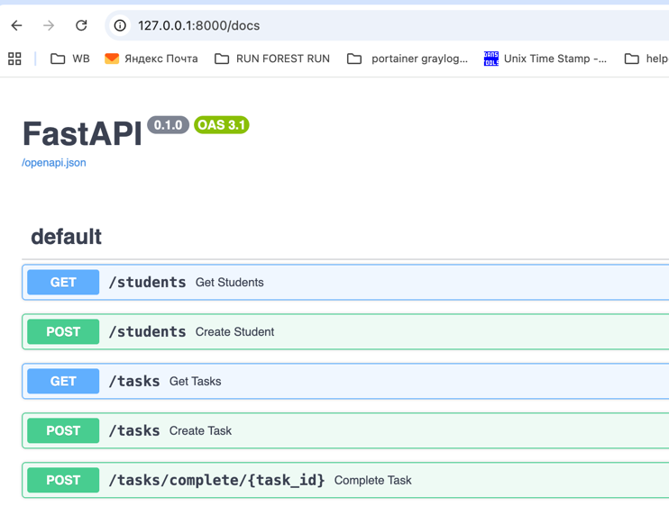

# Описание проекта

## Система позволяет:

- добавлять студентов;
- создавать учебные задания;
- отслеживать статус выполнения заданий;
- получать список студентов и заданий.
Проект реализован как учебный пример программного решения, поддерживающего образовательный процесс.

В соответствии с описанием в Кейс-задаче №3:

## Анализ требований

На этапе анализа требований была определена основная задача системы — упрощение контроля выполнения учебных заданий студентами.

### Основные функциональные требования:
- хранение информации о студентах;
- хранение информации о заданиях;
- возможность назначения задания студенту;
- возможность отметить задание как выполненное;
- получение списка заданий и их статуса.

### Нефункциональные требования:
- простота использования;
- понятная структура системы;
- возможность дальнейшего расширения.

## Проектирование

На этапе проектирования была определена архитектура программного решения.
Основные технологические решения:
- язык программирования: Python
- фреймворк для разработки API: FastAPI
- библиотека тестирования: pytest

Система построена по простой модульной архитектуре и состоит из следующих компонентов:
- модуль управления студентами;
- модуль управления заданиями;
- модуль хранения данных;
- модуль тестирования.

# Разработка

На этапе разработки был реализован программный сервис, предоставляющий API для работы с системой.
## Основные функции системы:
- создание студента;
- просмотр списка студентов;
- создание задания;
- просмотр списка заданий;
- отметка задания как выполненного.

Система реализована в виде REST API.

# Тестирование
Для проверки корректности работы системы были разработаны автотесты.
Тестирование выполняется с использованием библиотеки `pytest`.

`Тесты проверяют`:
- создание студентов;
- создание заданий;
- корректность ответов API.

# Реализация

Исходный код проекта размещён в репозитории GitHub.
Проект может быть развернут локально и протестирован с помощью встроенной документации API.

## Поддержка и дальнейшее развитие

В дальнейшем система может быть расширена следующими возможностями:

- добавление базы данных;
- реализация авторизации пользователей;
- создание веб-интерфейса;
- интеграция с образовательными платформами университета.

# Установка и запуск проекта

## Установить зависимости:

```
pip install -r requirements.txt
```

## Запустить сервер:

```
uvicorn main:app --reload
```

После запуска API будет доступно по адресу:

http://127.0.0.1:8000

## Документация API:

http://127.0.0.1:8000/docs



## Запуск тестов

Для запуска тестов используйте команду:

```
pytest
```